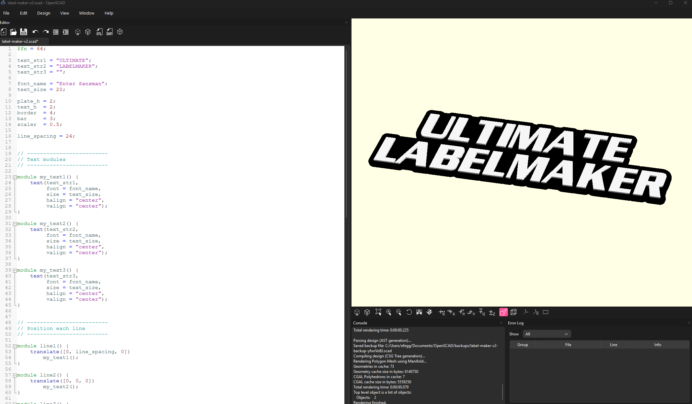
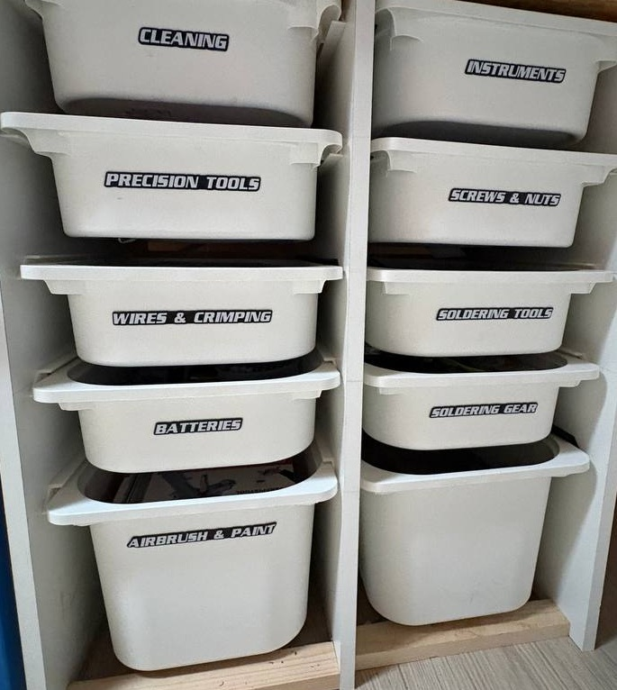

# Ultimate Label Maker

A customizable OpenSCAD model for creating raised labels for storage bins, drawers, tools, and other organized spaces. The default model creates a two-line `ULTIMATE LABELMAKER` tag with a black base and raised white text.

## Preview

*The label model opened in OpenSCAD.*

*Example labels applied to storage bins.*

## Requirements

- OpenSCAD
- The font configured in the model (`Enter Sansman`), installed on your system
- A 3D printer and compatible filament for the chosen color setup

## Customize the label

Open `label-maker.scad` in OpenSCAD and edit the values near the top of the file:

- `text_str1`, `text_str2`, and `text_str3`: label lines
- `font_name`: installed font name
- `text_size`: text size
- `plate_h`: base thickness
- `text_h`: raised text height
- `border` and `bar`: base outline and connecting bar sizes
- `line_spacing`: distance between text lines

Use **Preview** or **Render** to inspect the result before exporting.

## Export for multicolor printing

Use the latest available version of OpenSCAD when exporting to 3MF. The current release is recommended because it supports exporting multiple parts in one 3MF file, which makes it possible to assign separate colors to the label base and raised text for multicolor 3D printing.

Export the model as a 3MF file, then assign filament colors to the separate parts in your slicer. Confirm that the base and raised text remain separate objects after import.

## License

No license has been specified for this project yet.
